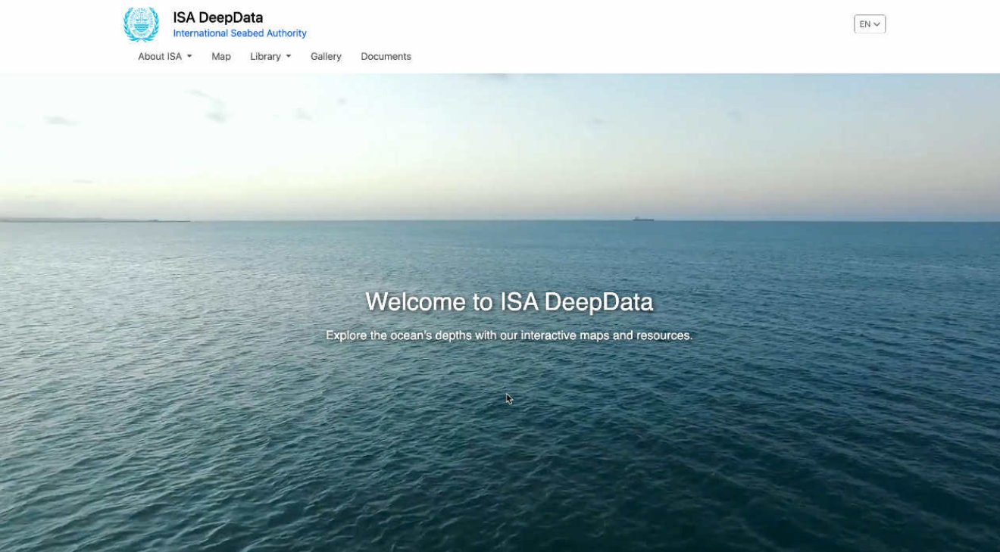
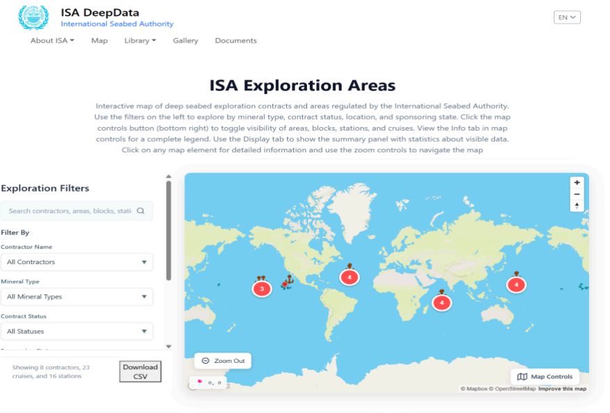
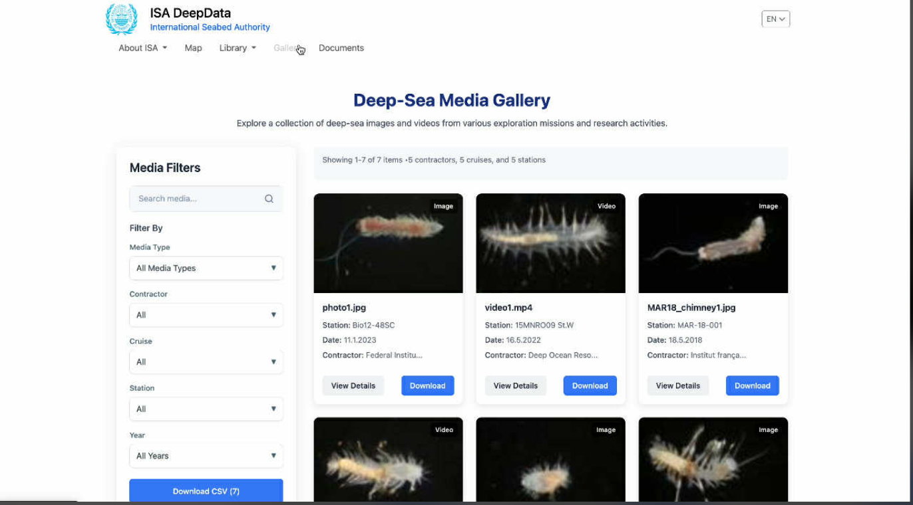

# [Project Name] - ISA DeepData Platform Enhancement

### LINK TO GITHUB:

https://github.com/HassanYusuf1/Bachelor

## Overview

This project presents a comprehensive redesign of the International Seabed Authority's DeepData platform,
addressing critical usability challenges that previously limited access to valuable marine environmental data.
Our solution transforms the user experience through intuitive navigation, flexible filtering mechanisms, and enhanced visualization tools,
enabling researchers, policymakers, and the public to effectively explore and utilize seabed data.

## Features

- Improved map navigation and visualization
- Modular filtering system
- Streamlined data access and download capabilities
- Enhanced media gallery for images and videos
- Multilingual support (English, Spanish, French)
- Responsive design for multiple screen sizes

## Technologies Used

- Frontend: React, TypeScript, Next.js, Tailwind CSS
- Backend: ASP.NET Core, C#
- Database: SQLite
- Cloud Storage: Azure Blob Storage
- Mapping: React Map GL / Mapbox GL

## Installation and Setup

### Tools

- .NET 8 (ASP.NET Core)
- Microsoft.AspNetCore.Cors
- Entity Framework Core 9
- React 19.0.0
- Next 15.1.6
- Typescript 5

### Create local file to run program

1. Create a file under frontend directory: `.env.local`
2. Paste this content:
   NEXT_PUBLIC_MAPBOX_TOKEN=pk.eyJ1IjoiaGFzc2FuMjMwNSIsImEiOiJjbTduZWxuamMwMGYzMnhzNWdjemF2bWd5In0.SQq7tqewygAwAQQEhAEonQ
   NEXT_PUBLIC_API_URL=http://localhost:5062/api

### Screenschots
- home page 

- map page

- gallery page

### Backend Setup

- Use terminal

1. Navigate to the backend directory: `cd Api`
2. Install dependencies: `dotnet build`
3. Run the backend: `dotnet run`

### Frontend Setup

- Create new terminal

1. Navigate to the frontend directory: `cd frontend`
2. Install dependencies: `npm install`
3. Run the development server: `npm run dev`
4. Open [http://localhost:3000]in your browser

### To activate map function on MacBook

1. Navigate to the frontend directory: `cd frontend`
2. Install react map component: `npm install --save babel-loader react-map-gl`
